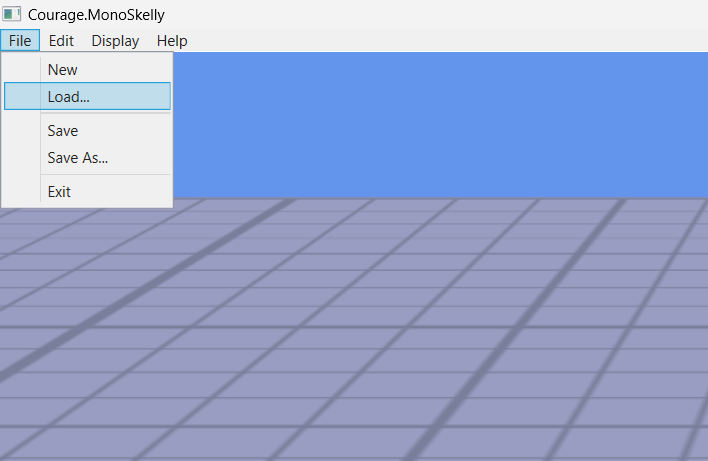

# Courage MonoSkelly

### WPF front-end for the MonoSkelly Animation Editor built on top of the MonoGame framework

## Features
* Camera control
    * Mouse-wheel to zoom in.
    * Mouse-wheel click to pan
    * Right-click + to rotate
* Loading File
    *  
    *  
* Playhead scrubbing, Playback Control, Frame Rate Control
    *  

## Work in progress
* Keyframe manipulation
    * 

## Wishlist
* Keyframe creation/deletion
* Animation creation/deletion
* Transform manipulations 
* Spline editor 
* File management
* Transform + Rotate Gizmos for the bones

## Details

MonoGame embedded inside a WPF app as a `dotnet new` template.

## Prerequisites

This template uses .NET Core 6. If you're having trouble getting it to compile make sure you've updated to the latest version. I have confirmed that it works with:

 - Visual Studio 2022 or later.
 - [.NET Core 6.0.422](https://dotnet.microsoft.com/download/dotnet-core/6.0) which should install with Visual Studio anyway.
 - The MonoGame NuGet packages are not .NET Core compatible, so you'll also need .NET Framework 4.7.2 installed.

## Installing

* `git clone`
* MonoGame is added as a submodule for easier debugging
    * `git submodule`
* Make sure that the `.human` ini file is placed in the saves folder created at the same location as the executable